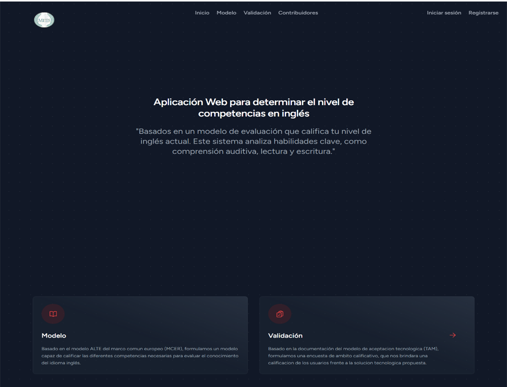
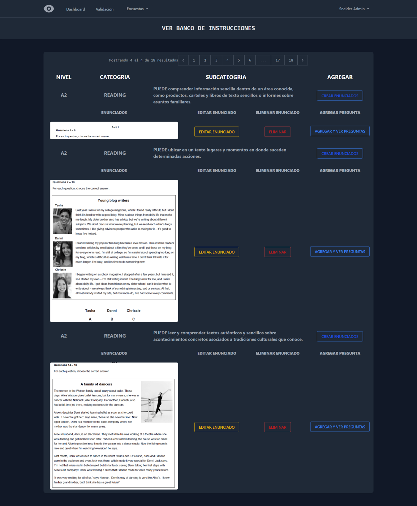
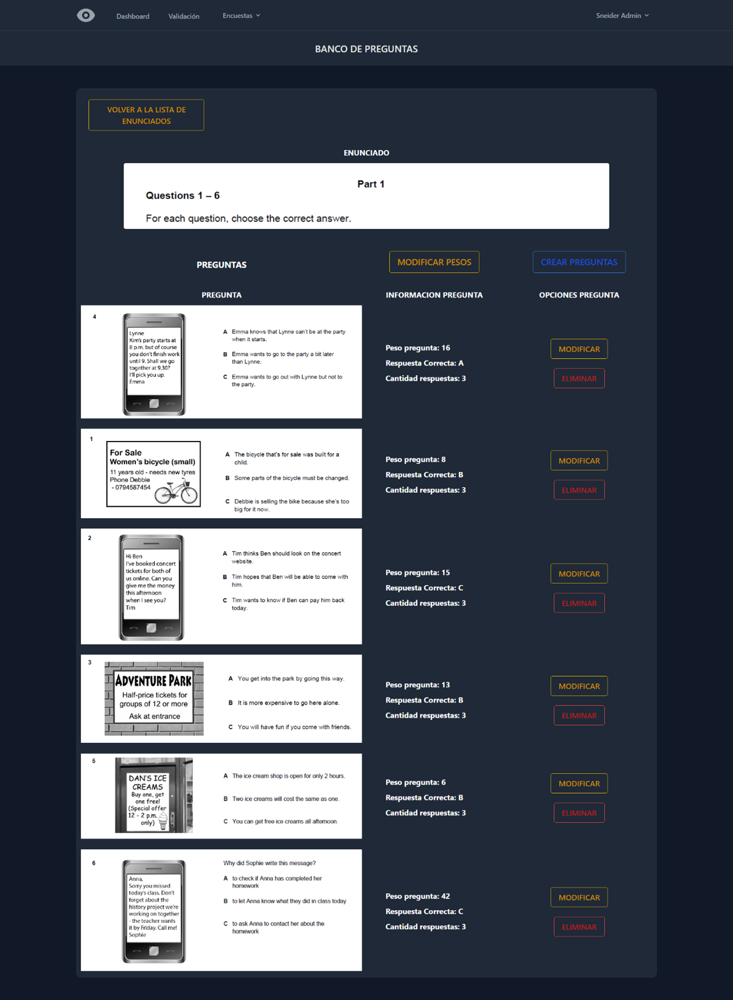

# Aplicación Web para Determinar el Nivel de Competencias en Inglés

## Video Explicativo
[Explora más sobre la aplicación en este video](https://www.youtube.com/watch?v=YmiHvIWOZ-Q)

## Descripción del Proyecto

Esta aplicación web fue desarrollada como proyecto de grado para la Tecnología en Sistematización de Datos de la **Universidad Distrital**. Su objetivo principal es evaluar el nivel de competencias en inglés, analizando habilidades clave como comprensión auditiva, lectura y escritura. La evaluación está basada en un modelo estructurado que categoriza el nivel de inglés de los usuarios.

El sistema fue construido utilizando **Laravel** como framework de **back-end**, con una base de datos **PostgreSQL** y herramientas de **front-end** como **HTML**, **TailwindCSS** y **JavaScript**.

### Tecnologías Clave
- **Framework**: Laravel (PHP)
- **Base de Datos**: PostgreSQL
- **Frontend**: HTML, TailwindCSS, JavaScript
- **Almacenamiento de Archivos**: Amazon Web Services (AWS S3)

---

## Características y Funcionalidades

### 1. Diseño e Implementación de la Base de Datos
- Se creó una base de datos relacional que satisface todas las necesidades del proyecto.
- Se aplicaron principios de diseño de esquemas, incluyendo modelos ER, normalización y gestión de relaciones (1-1, 1-N, N-N).
- Optimización de consultas SQL Por medio del ORM de Laravel Eloquent para mejorar el rendimiento y la legibilidad de las consultas.

### 2. Autenticación y Sistema de Roles y Permisos
- Implementación de un sistema de autenticación seguro que permite a los usuarios registrarse e iniciar sesión.
- Uso de **conceptos de roles y permisos** para dividir las funcionalidades entre **usuarios regulares** (estudiantes) y **administradores**.
  - **Estudiantes**: Pueden realizar los exámenes y recibir retroalimentación sobre su desempeño.
  - **Administradores**: Gestionan las preguntas del examen, revisan resultados y administran usuarios.

### 3. Patrón de Arquitectura MVC
- Se implementó el patrón de arquitectura Modelo-Vista-Controlador (MVC), permitiendo:
  - Una organización clara del código.
  - Separación de responsabilidades.
  - Mejoras en la escalabilidad y mantenibilidad del proyecto.

### 4. Almacenamiento en Amazon Web Services
- Archivos multimedia utilizados en los exámenes (como imágenes y videos) se almacenan en buckets de **Amazon S3**.
- Esta solución asegura alta disponibilidad del contenido y evita redundancias, optimizando la experiencia del usuario.

---

## PAGINA DE INICIO (ALL USERS)

## MODIFICACION DE ENUNCIADOS (ADMINS)

## MODIFICACION DE PREGUNTAS (ADMINS)

## VISUALIZACION DE RESULTADOS (STUDENTS)

## ENCUESTA DE SATISFACCION (STUDENTS)

